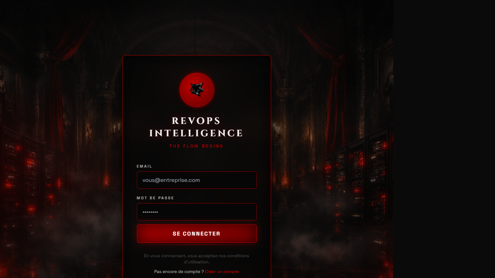
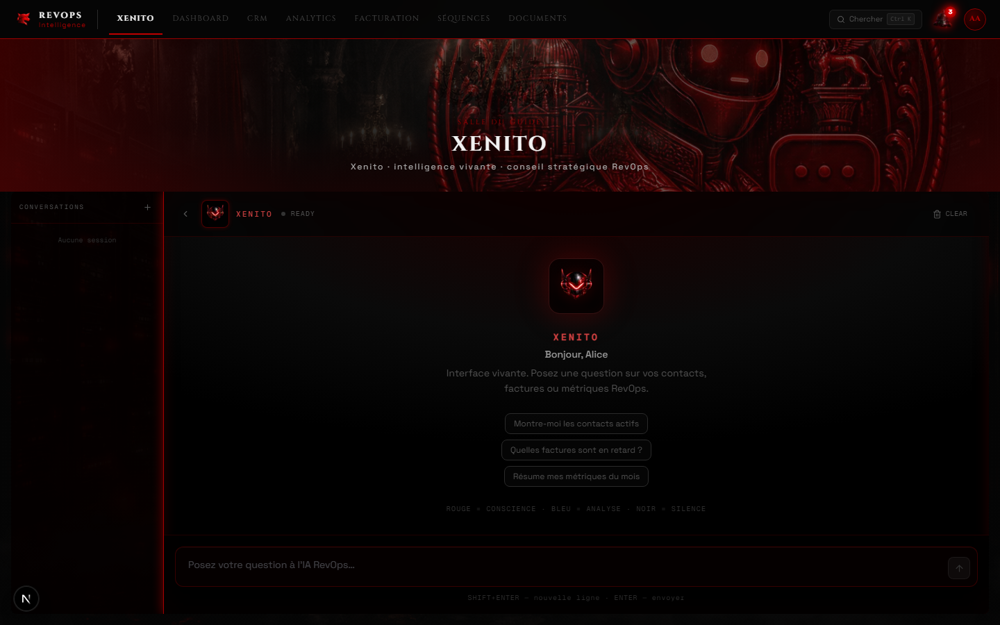
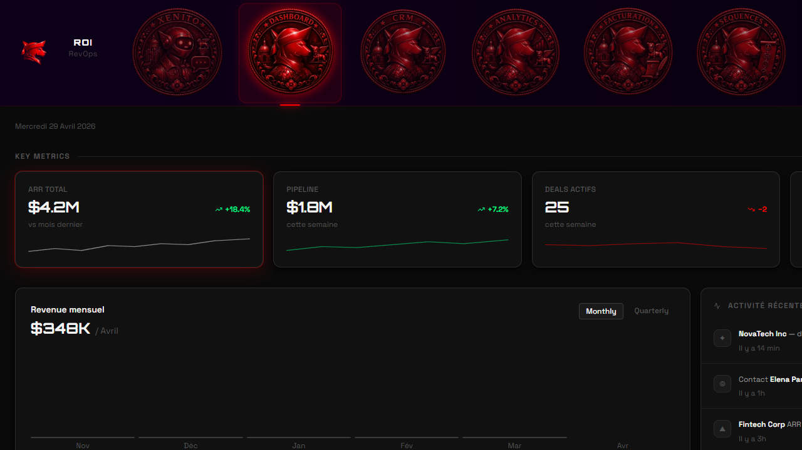
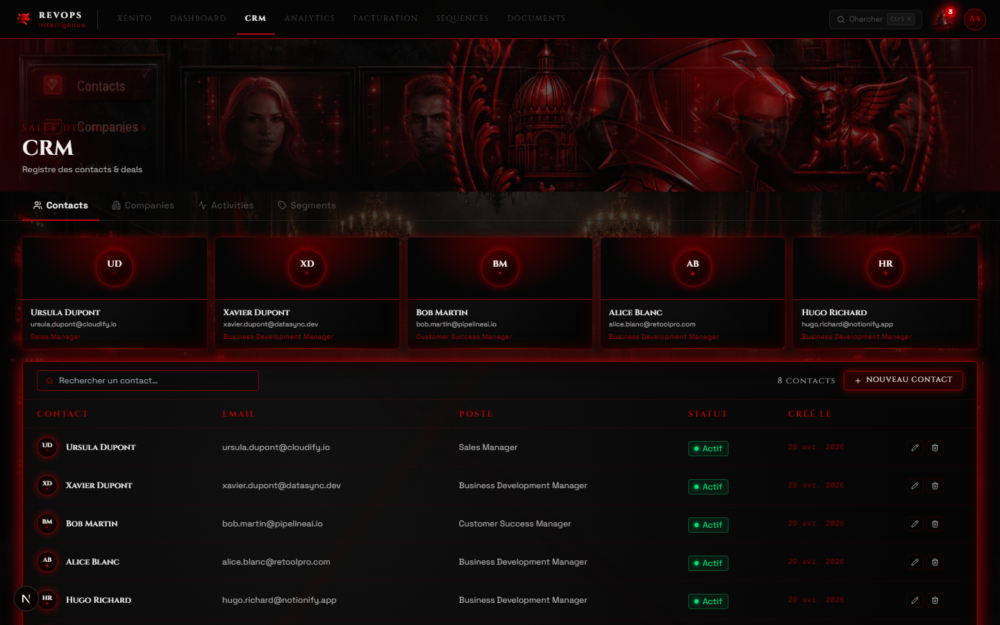
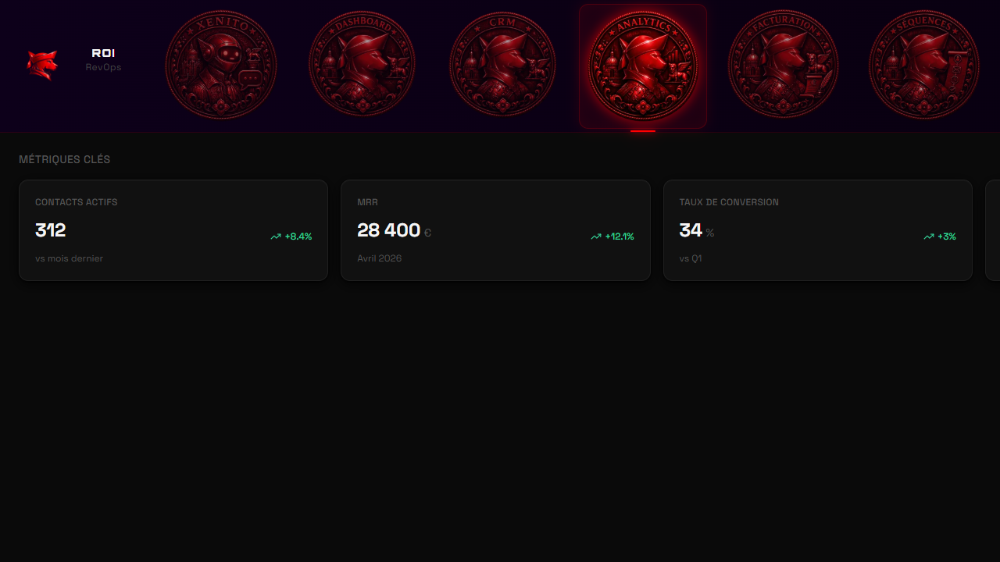
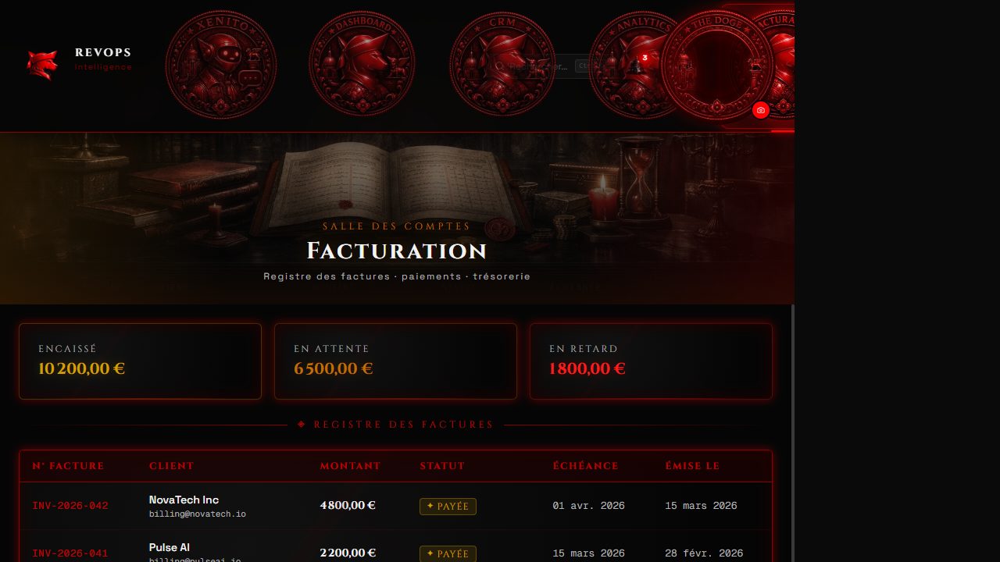
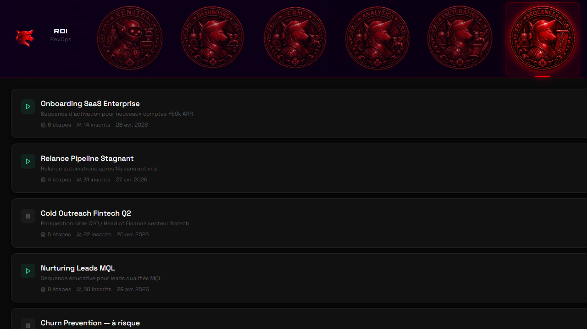
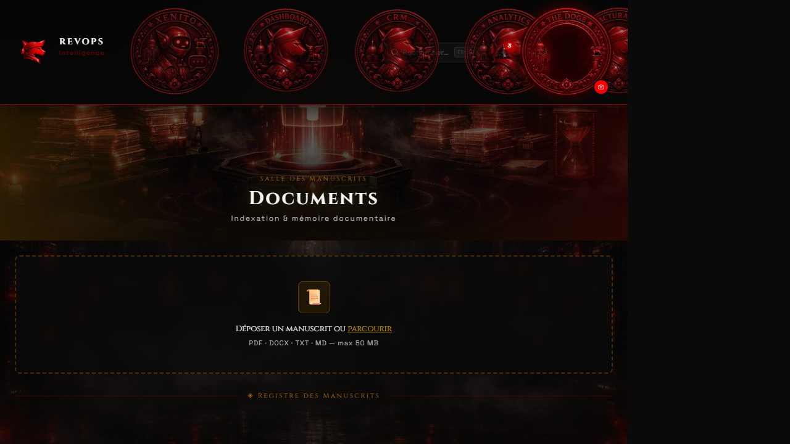

# ROI — RevOps Intelligence

> Plateforme RevOps **IA-native** propulsée par **Xenito**, le copilote IA dédié aux équipes Sales, Marketing et Customer Success.  
> Design system **Venetian Cyber-Gothic OS** — crimson · marbre noir · ambre doré.



---

## Design System — Venetian Cyber-Gothic OS

L'interface adopte une esthétique "Palais Ducal cyberpunk" : fonds noirs marbrés, typographie Cinzel romaine, accents rouge cramoisi et ambre doré, animations `pulseMarbre` sur chaque tableau de données.

| Token | Valeur | Usage |
|---|---|---|
| `--red-doge` | `#C00000` | Accents primaires, bordures actives |
| `--red-glow` | `#FF1A1A` | Glows, badges, erreurs |
| `--amber-gold` | `#D4A000` | Métriques positives, headings secondaires |
| `--amethyst` | `#9B4FD4` | Info, séquences |
| `--black-deep` | `#050505` | Fond principal |
| `font-cinzel` | Google Fonts | Titres, labels uppercase |
| `pulseMarbre` | 2.4s ease-in-out | Animation box-shadow rouge sur tableaux |

---

## Tour de l'interface

### Xenito — Copilote IA RevOps

Interface conversationnelle full-screen. Xenito orchestre vos données CRM, facturation et analytics en langage naturel. Chaque message déclenche une pipeline complète : `LLM → MCP tools → synthèse`.



> **Pipeline MCP** : les badges `Billing · list_overdue_payments` et `Analytics · get_mrr_trend` confirment que l'orchestrateur Rust appelle les outils métier avant de synthétiser la réponse via Anthropic `claude-haiku-4-5`. Les ToolCards affichent en rouge les appels en erreur avec détection automatique (`isToolError`).

---

### Dashboard — Salle du Conseil

KPIs temps réel : ARR, pipeline, deals actifs, win rate. Graphique revenue mensuel/trimestriel + fil d'activité récente + deals en vedette.



| Métrique | Valeur | Tendance |
|---|---|---|
| ARR Total | $4.2M | +18.4% vs mois dernier |
| Pipeline | $1.8M | +7.2% cette semaine |
| Deals actifs | 25 | −2 cette semaine |
| Win Rate | 34% | +3 pts vs Q1 |

---

### CRM — Salle des Masques

Module CRM complet avec 4 onglets :

- **Contacts** — galerie de portraits, recherche full-text, statuts colorés (Active / Lead / Customer / Churned)
- **Companies** — liste des comptes avec secteur (`IndustryBadge`), taille, ARR formaté (ex. `1.2M€`), pagination
- **Activities (Deals pipeline)** — pipeline commercial avec `StageBadge` par étape, barres de probabilité (vert ≥70%, ambre ≥40%, rouge <40%), KPIs pipeline en header, filtre par étape
- **Segments** — regroupement automatique des contacts par statut, cartes avec progression et pourcentages

RLS PostgreSQL garantit l'isolation stricte par tenant.



---

### Analytics — Salle des Archives

Vue consolidée : contacts actifs (312), MRR (28 400 €), taux de conversion (34%), séquences actives (7). Charts MRR trend + funnel pipeline + état factures.



---

### Facturation — Salle des Comptes

Registre des factures avec statuts colorés (Payée · En attente · En retard), totaux encaissé/attente/retard en header, tri par échéance.



---

### Séquences — Salle des Rituels

Cadences d'outreach multi-canal nommées "rituels". Statuts Active / En pause / Brouillon / Terminée avec barres de progression et métriques d'inscription.



---

### Documents — Salle des Manuscrits

Ingestion documentaire multi-tenant. Drag & drop PDF/DOCX/TXT/MD → indexation pgvector → accessible depuis Xenito en contexte conversationnel.



---

## Vision

Construire un SaaS RevOps moderne, **IA-native**, qui s'appuie sur :

- **LLM orchestrateur stateless** (Rust/Axum) — reconstruit le contexte à chaque requête, appelle RAG + MCP
- **Couche MCP** exposant les capacités métier (CRM, Billing, Analytics, Sequences, Filesystem)
- **RAG** pour la mémoire documentaire et le contexte long terme
- **Backend multi-tenant** sécurisé — RLS PostgreSQL, isolation stricte par tenant
- **UI conversationnelle** enrichie de vues structurées (tableaux, dashboards, formulaires)
- **Architecture scalable** (queue, batching, cluster LLM)

---

## Architecture

```
Client (Next.js 15)
    │
    ├── Auth — httpOnly cookies, JWT HS256, middleware RLS
    ├── API Backend (FastAPI 0.110 + asyncpg) ──── :18000
    │       ├── Sessions, CRM, Users, Documents
    │       └── PostgreSQL 16 (RLS multi-tenant) ── :5433
    │
    └── Chat SSE ──► Orchestrateur Rust (Axum) ──── :8003
                         ├── RAG (pgvector) ─────── :18500
                         ├── MCP CRM (Python) ───── :19001
                         ├── MCP Billing (Rust) ─── :19002
                         ├── MCP Analytics (Rust) ── :19003
                         ├── MCP Sequences (Rust) ── :19004
                         └── Anthropic LLM ─ claude-haiku-4-5
```

---

## Stack technique

| Couche | Technologie | Port |
|---|---|---|
| Frontend | Next.js 15, TypeScript, Tailwind CSS | :13000 |
| Backend API | FastAPI, SQLAlchemy async, Alembic | :18000 |
| Orchestrateur LLM | Rust / Axum, SSE streaming | :8003 |
| RAG | FastAPI + pgvector | :18500 |
| MCP CRM | Python FastAPI | :19001 |
| MCP Billing/Analytics/Sequences/FS | Rust (Axum) | :19002–:19005 |
| Base de données | PostgreSQL 16 (RLS multi-tenant) | :5433 |
| Cache / Queue | Redis | :6380 |

**LLM** : Anthropic (`claude-haiku-4-5`) — streaming SSE end-to-end.

---

## Structure du repo

```
backend/      API FastAPI — auth cookie, RLS, sessions, users, CRM
frontend/     UI Next.js — Xenito, Dashboard, CRM, Analytics, Billing, Sequences, Documents
orchestrator/ Rust/Axum — orchestration LLM, RAG, MCP, SSE streaming
mcp/          Microservices métier (CRM Python + Billing/Analytics/Sequences/FS Rust)
rag/          Ingestion et retrieval documentaire (pgvector)
infra/        Docker Compose, Kubernetes, Terraform, CI/CD, monitoring
docs/         ADRs, specs fonctionnelles, plan de dev, screenshots
```

---

## Démarrage local

```bash
# 1. Infra (Postgres + Redis)
docker compose -f infra/docker/docker-compose.dev.yml up -d

# 2. Migrations + seed démo
cd backend
python -m alembic upgrade head
python scripts/seed_demo.py

# 3. Backend API
uvicorn app.main:app --port 18000 --reload

# 4. Orchestrateur
cd orchestrator && cargo run

# 5. MCP CRM
cd mcp/mcp-crm && uvicorn src.main:app --port 19001 --reload

# 6. Frontend
cd frontend && npm install && npm run dev
```

**Credentials démo** : `admin@acme.io` / `acme1234` — org `acme-revops`

---

## Tests (backend)

```
28 passed   — auth, JWT, CRM permissions, tenant isolation, RLS, sessions
 3 xfailed  — RLS superuser, repository event loop (attendus)
 0 failures
```

```bash
cd backend && python -m pytest tests/ -q
```

---

## État du projet (3 mai 2026)

### Frontend v2 — UX overhaul ✅ (merge `feature/ux-fixes`)

**Design System**
- **Venetian Cyber-Gothic OS** : palette crimson/ambre/améthyste, Cinzel + Space Grotesk + Geist Mono, animations CSS (pulseMarbre, bellRing, badgePulse, fog/smoke)
- **Navigation compacte 56px** : texte Cinzel uppercase, icônes comme watermarks décoratifs, z-index notifications corrigé
- **Composants UI** : `Badge` CSS vars, `Skeleton` (6 variantes), `EmptyState` (7 types avec glyphs SVG)

**XENITO — Copilote IA**
- Timestamps corrigés : `MsgTime` affiche désormais `message.createdAt` (et non l'heure de rendu)
- Contraste user messages : `var(--text-primary)` blanc sur fond rouge sombre (était illisible)
- `ToolInvocationCard` : détection auto des erreurs MCP → carte rouge + label `Outil en erreur`

**CRM — Salle des Masques (4 onglets)**
- **Contacts** : galerie portraits, recherche full-text, pagination, statuts colorés
- **Companies** : `IndustryBadge` (SaaS/Finance/Healthcare/Retail/Media), ARR formaté, pagination
- **Activities (Deals)** : `StageBadge` 7 étapes + fallback unknown stage, barres probabilité tricolores, KPIs pipeline
- **Segments** : cartes par statut (`customer/active/lead/inactive/churned`), progress bars, % couverture

**Autres pages**
- **Dashboard** : KPIs, revenue chart, activité récente, deals en vedette
- **Analytics** : metrics cards + MRR chart + funnel pipeline + billing status
- **Facturation** : registre invoices multi-statut, totaux header
- **Séquences** : rituels outreach avec progression, 6 cadences seedées
- **Documents** : drop zone RAG + registre manuscrits

### Backend & Infra ✅

- **Auth** : login/logout cookie httpOnly, refresh token, middleware JWT ASGI, RLS multi-tenant
- **CRM** : contacts, accounts, deals — RLS par tenant, RBAC
- **Seed data** : 50 contacts, 6 invoices, 6 séquences, 4 métriques analytiques
- **Tests** : 28 passed — auth, JWT, CRM permissions, tenant isolation, RLS, sessions

### Chat IA ✅

- **Orchestrateur Rust** (Axum) : SSE streaming stateless end-to-end
- **MCP routing** : `Billing · list_overdue_payments`, `Analytics · get_mrr_trend`, `CRM · search_contacts`
- **RAG** : pgvector backend opérationnel
- **LLM** : Anthropic `claude-haiku-4-5`
- **Mock mode** : rendu des vraies données de résultat MCP (plus de données hardcodées)

### Prochaines étapes

- [ ] Dashboard KPIs — brancher sur vraie API (actuellement hardcodé `$4.2M ARR`)
- [ ] MCP Sequences — fix `cargo sqlx prepare` (2 queries uncached dans `email.rs`)
- [ ] MCP Billing + Analytics — connexion complète orchestrateur (données live)
- [ ] RAG : pipeline ingestion PDF → pgvector front-to-back
- [ ] Observabilité : métriques LLM, latences par tenant (OpenTelemetry)
- [ ] Rate limiting production (Redis token bucket)
- [ ] CI/CD pipeline GitHub Actions → Docker build → deploy

---

## Standards & principes

- **Rust** idiomatique pour `mcp/` et `orchestrator/` (Axum, Tokio)
- **Python** pour backend et MCP CRM (FastAPI, SQLAlchemy async, Pydantic v2)
- **TypeScript strict** pour le frontend (Next.js 15 App Router)
- Services **stateless** -- l'orchestrateur reconstruit le contexte a chaque requete
- **RLS PostgreSQL** -- isolation tenant au niveau base de donnees (ADR-005)
- MCP = source de verite metier | RAG = memoire documentaire | LLM = cerveau orchestrateur
