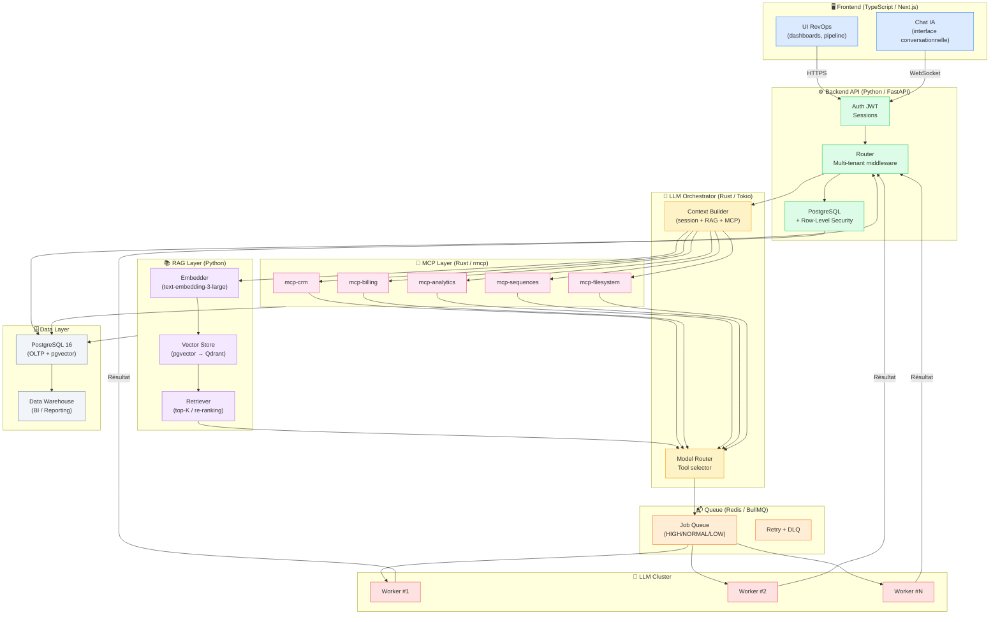

# Architecture du Projet RevOps IA SaaS

Document de référence architecturale pour tous les agents développeurs du projet.

> **Dernière mise à jour** : 2026-03-17  
> **Phase** : Phase 2 — MCP CRM (en cours)  
> **Décideurs** : Architecte Système  
> **Charte** : [docs/PROJECT_MANAGER_CHARTER.md](./PROJECT_MANAGER_CHARTER.md)  
> **ADRs** : [docs/adr/README.md](./adr/README.md)

---

## Table des matières

1. [Vue d'ensemble](#1-vue-densemble)
2. [Diagramme ASCII](#2-diagramme-ascii)
3. [Diagramme Mermaid](#3-diagramme-mermaid)
4. [Description des couches](#4-description-des-couches)
5. [Flux de données typiques](#5-flux-de-données-typiques)
6. [Conventions inter-couches](#6-conventions-inter-couches)
7. [Principes architecturaux](#7-principes-architecturaux)
8. [Références ADR](#8-références-adr)

---

## 1. Vue d'ensemble

Le système est organisé en **8 couches verticales** suivant un modèle de traitement de la requête utilisateur vers les données brutes. Chaque couche a une responsabilité unique et des interfaces clairement définies avec ses voisines.

| # | Couche | Rôle principal | Technologie |
|---|--------|----------------|-------------|
| 1 | **Frontend** | Interface utilisateur RevOps + chat IA | TypeScript / React / Next.js |
| 2 | **Backend API** | Auth JWT, sessions, routing, multi-tenant | Python / FastAPI / PostgreSQL |
| 3 | **LLM Orchestrator** | Reconstruction du contexte, appels RAG + MCP | Rust / Tokio |
| 4 | **RAG Layer** | Mémoire documentaire, recherche sémantique | Python / pgvector / Qdrant |
| 5 | **Queue** | File de traitement LLM, priorités, batching | Redis / BullMQ |
| 6 | **LLM Cluster** | Inférence LLM, workers stateless | N instances GPU |
| 7 | **MCP Layer** | Microservices métier, accès données structurées | Rust / rmcp |
| 8 | **Data Layer** | Persistance OLTP + Data Warehouse BI | PostgreSQL / DW |

---

## 2. Diagramme ASCII

```
                    ┌───────────────────────────────────────┐
                    │              FRONTEND                 │
                    │   UI RevOps (dashboards, pipeline)    │
                    │   Chat IA (interface conversationnelle)│
                    │   TypeScript · React · Next.js        │
                    └──────────────────┬────────────────────┘
                                       │  HTTPS / REST / WebSocket
                                       ▼
                    ┌───────────────────────────────────────┐
                    │            BACKEND API                │
                    │  Auth JWT · Sessions · Routing        │
                    │  Multi-tenant (RLS) · Rate limiting   │
                    │  Python · FastAPI · SQLAlchemy        │
                    └──────────────────┬────────────────────┘
                                       │  Internal HTTP / gRPC
                                       ▼
                    ┌───────────────────────────────────────┐
                    │          LLM ORCHESTRATOR             │
                    │  Reconstruction du contexte           │
                    │  session + RAG + MCP → prompt complet │
                    │  Sélection modèle · Routing tools     │
                    │  Rust · Tokio (stateless)             │
                    └───────┬───────────────────┬───────────┘
                            │                   │
               ┌────────────▼──────┐   ┌────────▼──────────────┐
               │    RAG LAYER      │   │      MCP LAYER        │
               │  Embeddings       │   │  mcp-crm              │
               │  Vector search    │   │  mcp-billing          │
               │  Retrievers/tenant│   │  mcp-analytics        │
               │  Python · pgvector│   │  mcp-sequences        │
               └────────────┬──────┘   │  mcp-filesystem       │
                            │          │  Rust · rmcp          │
                            │          └────────┬──────────────┘
                            │                   │
                            └─────────┬─────────┘
                                      │  Contexte complet assemblé
                                      ▼
                    ┌───────────────────────────────────────┐
                    │        QUEUE (LLM Jobs)               │
                    │  Priorités HIGH / NORMAL / LOW        │
                    │  Batching GPU · Retry · DLQ           │
                    │  Redis · BullMQ                       │
                    └──────────────────┬────────────────────┘
                                       │  Job dispatch
                                       ▼
                    ┌───────────────────────────────────────┐
                    │           LLM CLUSTER                 │
                    │  N workers stateless                  │
                    │  Inférence batch GPU                  │
                    │  Scaling horizontal automatique       │
                    └──────────────────┬────────────────────┘
                                       │
                                       ▼
                    ┌───────────────────────────────────────┐
                    │           DATA LAYER                  │
                    │  PostgreSQL 16 (OLTP + pgvector)      │
                    │  Data Warehouse (BI / Reporting)      │
                    │  Row-Level Security par tenant        │
                    └───────────────────────────────────────┘
```

---

## 3. Diagramme Mermaid



---

## 4. Description des couches

### 4.1 Frontend

**Rôle** : Interface utilisateur du produit RevOps. Deux surfaces principales :
- **UI RevOps structurée** : dashboards pipeline, vue des deals, métriques, gestion des comptes
- **Chat IA** : interface conversationnelle pour interagir avec l'IA en langage naturel

**Technologie** : TypeScript 5 · React 19 · Next.js 15 (App Router) · Tailwind CSS

**Interfaces** :
- Communique avec le Backend API via REST (JSON) pour les données structurées
- Utilise WebSocket ou Server-Sent Events pour le streaming des réponses LLM
- Authentification via JWT stocké en cookie HttpOnly sécurisé

**Responsabilités** :
- Rendu des pages (SSR via Next.js pour le SEO et la performance initiale)
- Gestion de l'état client (sessions, cache)
- Streaming des réponses IA en temps réel
- Formulaires et validation côté client

---

### 4.2 Backend API

**Rôle** : Gardien du système. Point d'entrée unique pour toutes les requêtes authentifiées. Orchestre l'authentification, l'isolation tenant et le routing vers les composants internes.

**Technologie** : Python 3.12 · FastAPI · Pydantic v2 · SQLAlchemy 2.0 · Alembic · PostgreSQL 16

**Interfaces** :
- **Entrante** : HTTPS depuis le Frontend (REST JSON + WebSocket)
- **Sortante** : HTTP interne vers l'Orchestrateur LLM, accès DB PostgreSQL via SQLAlchemy

**Responsabilités** :
- Validation et signature des tokens JWT (authentification + scopes)
- Middleware d'isolation tenant : positionne `app.current_tenant_id` dans la session DB
- Gestion des sessions utilisateur (historique de conversation en DB)
- Routing des requêtes IA vers l'Orchestrateur
- API CRUD pour les entités non-IA (profil utilisateur, settings, documents uploadés)
- Rate limiting par tenant
- Retour des réponses LLM au Frontend (via callback ou streaming)

---

### 4.3 LLM Orchestrator

**Rôle** : Cerveau de coordination stateless. Reconstruit le contexte complet de chaque requête et orchestre les appels RAG et MCP avant d'enqueuer le job LLM.

**Technologie** : Rust (édition 2021) · Tokio · rmcp · reqwest

**Interfaces** :
- **Entrante** : HTTP interne depuis le Backend API (requête + session_id + tenant_id)
- **Sortante** : appels RAG Layer (HTTP), appels MCP Layer (protocole MCP), push dans la Queue Redis

**Responsabilités** :
- Récupération de l'historique de session depuis la DB (via Backend API)
- Appel parallèle au RAG Layer pour les extraits documentaires pertinents
- Appel aux serveurs MCP nécessaires pour les données métier en temps réel
- Assemblage du prompt complet (system prompt + historique + extraits RAG + données MCP + requête utilisateur)
- Sélection du modèle LLM approprié selon le type de requête
- Enqueue du job dans la Queue avec priorité et métadonnées tenant

**Contrainte absolue** : **STATELESS** — aucune variable d'instance ou état global mutable. Tout le contexte est passé en paramètre ou reconstruit depuis les sources externes.

---

### 4.4 RAG Layer

**Rôle** : Mémoire documentaire long-terme du système. Permet au LLM d'accéder aux playbooks, QBR, notes et historiques qui dépassent la fenêtre de contexte.

**Technologie** : Python 3.12 · LangChain ou LlamaIndex · pgvector (MVP) · Qdrant (scale) · text-embedding-3-large

**Interfaces** :
- **Entrante** : requêtes de retrieval depuis l'Orchestrateur (HTTP/REST, paramètres : texte de requête + tenant_id + filtres optionnels)
- **Entrante (ingestion)** : documents soumis via le Backend API ou mcp-filesystem
- **Sortante** : top-K chunks pertinents avec scores de similarité et métadonnées source

**Responsabilités** :
- Ingestion : chunking, embedding, stockage dans le vector store avec métadonnées tenant
- Retrieval : embedding de la requête, recherche cosinus dans le namespace tenant, re-ranking optionnel
- Gestion du cycle de vie des documents (mise à jour, suppression, réindexation)
- Isolation stricte par `tenant_id` (namespace/collection séparé par tenant)

---

### 4.5 Queue

**Rôle** : Tampon entre l'Orchestrateur et le Cluster LLM. Absorbe les pics de charge, gère les priorités et permet le batching GPU.

**Technologie** : Redis 7 · BullMQ (Node.js worker side) ou Tokio channels (Rust side)

**Interfaces** :
- **Entrante** : jobs pushés par l'Orchestrateur (payload : contexte complet + tenant_id + job_id + priorité)
- **Sortante** : jobs consommés par les workers LLM, résultats retournés via callback

**Responsabilités** :
- File à 3 niveaux de priorité : `HIGH` (interactif), `NORMAL` (batch), `LOW` (reporting)
- Retry automatique (3 tentatives, backoff exponentiel) sur échec worker
- Dead Letter Queue pour les jobs définitivement échoués
- Métriques en temps réel : longueur de queue, latence, throughput

---

### 4.6 LLM Cluster

**Rôle** : Infrastructure d'inférence LLM. Consomme les jobs de la Queue et retourne les réponses générées.

**Technologie** : N instances GPU (vLLM, TGI, ou API Cloud selon l'environnement)

**Interfaces** :
- **Entrante** : jobs depuis la Queue Redis
- **Sortante** : réponses générées retournées via callback au Backend API

**Responsabilités** :
- Inférence LLM (génération de texte) sur des batches de requêtes
- Scaling horizontal automatique basé sur la longueur de la Queue
- **STATELESS** : chaque worker traite un batch indépendamment, sans état persistant

---

### 4.7 MCP Layer

**Rôle** : Source de vérité métier pour le LLM. Encapsule tout accès aux données structurées derrière des tools MCP typés et sécurisés.

**Technologie** : Python 3.12 · mcp SDK (Anthropic) · httpx · Pydantic v2

> **ADR-008** : Les serveurs MCP n'ont **aucun accès direct à la base de données**. Ils appellent exclusivement le backend FastAPI via des endpoints internes HTTP (`/internal/v1/...`). Ce choix centralise le RLS, le RBAC et la logique métier dans le backend, et réduit la surface d'attaque (pas de credentials DB dans les MCPs). Voir [ADR-008](./adr/ADR-008-mcp-crm-architecture.md).

**Serveurs disponibles** :

| Serveur | Domaine | Outils principaux | Statut |
|---------|---------|-------------------|--------|
| `mcp-crm` | CRM — contacts, comptes, deals, pipeline | `get_contact`, `search_accounts`, `update_deal_stage` | Phase 2 |
| `mcp-billing` | Facturation, abonnements, paiements | `get_invoice`, `check_subscription`, `list_overdue` | Phase 3 |
| `mcp-analytics` | Métriques RevOps, pipeline, prévisions | `get_pipeline_metrics`, `compute_churn_rate`, `forecast_revenue` | Phase 3 |
| `mcp-sequences` | Séquences d'emails et outreach | `create_sequence`, `enroll_contact`, `get_performance` | Phase 4 |
| `mcp-filesystem` | Documents, fichiers, playbooks | `read_document`, `list_playbooks`, `upload_report` | Phase 4 |

**Interfaces** :
- **Entrante** : appels protocole MCP depuis l'Orchestrateur (tools calls avec paramètres typés + tenant_id)
- **Sortante** : appels HTTP internes vers le Backend API (`/internal/v1/...`) avec `X-Internal-API-Key` + `X-Tenant-ID`

**Responsabilités** :
- Validation et propagation systématique du `tenant_id` à chaque appel
- Traduction des tool calls MCP en requêtes HTTP vers le backend
- Gestion des erreurs HTTP → McpError (codes JSON-RPC standardisés)
- Schémas d'entrée/sortie validés par Pydantic (pas d'injection via le LLM)

**Ce que les MCPs ne font PAS** (par construction) :
- Aucune connexion Postgres directe
- Aucune requête SQL
- Aucun appel entre MCPs
- Aucune logique de RBAC ou de RLS (délégué au backend)

---

### 4.8 Data Layer

**Rôle** : Persistance durable de toutes les données du système.

**Technologie** : PostgreSQL 16 + pgvector (extension) · Data Warehouse (DuckDB ou BigQuery selon le volume)

**Schémas principaux** :
- `public` : données applicatives (users, organizations, sessions, documents)
- Données métier via les MCP (deals, contacts, invoices, sequences...) avec RLS
- Vecteurs d'embeddings via pgvector (table `embeddings` avec colonne `vector`)
- Logs d'audit des actions LLM/MCP

**Interfaces** :
- Accès via SQLAlchemy (Backend API, Python)
- Accès via sqlx (serveurs MCP, Rust)
- Accès vector search via pgvector (RAG Layer, Python)
- Accès BI via le Data Warehouse

---

## 5. Flux de données typiques

### 5.1 Requête IA conversationnelle (cas nominal)

```
Utilisateur → Frontend → Backend API → Orchestrateur → [RAG + MCP] → Queue → LLM Worker → Backend API → Frontend → Utilisateur

1.  L'utilisateur envoie un message dans le chat
2.  Le Frontend envoie POST /api/chat {message, session_id} avec JWT
3.  Le Backend API valide le JWT, extrait tenant_id, positionne RLS
4.  Le Backend API transmet la requête à l'Orchestrateur avec {message, session_id, tenant_id}
5.  L'Orchestrateur récupère l'historique de session (appel DB via Backend)
6.  L'Orchestrateur appelle en parallèle :
    a. RAG Layer → retrieve(query=message, tenant_id=...) → 5 chunks pertinents
    b. Les serveurs MCP nécessaires (ex: mcp-crm → get_pipeline_summary)
7.  L'Orchestrateur assemble le prompt complet :
    [system_prompt] + [historique] + [chunks RAG] + [données MCP] + [message user]
8.  L'Orchestrateur pushes le job dans la Queue Redis avec priorité HIGH
9.  Un LLM Worker consomme le job, génère la réponse
10. La réponse est retournée au Backend API (via callback)
11. Le Backend API sauvegarde le tour de conversation en DB
12. Le Backend API stream la réponse au Frontend via SSE
13. Le Frontend affiche la réponse en temps réel (token par token)

Latence cible : < 3 secondes jusqu'au premier token affiché
```

### 5.2 Ingestion de document (playbook, QBR...)

```
1.  L'utilisateur upload un document via le Frontend
2.  Le Backend API reçoit le fichier, valide le type (PDF, DOCX, MD) et la taille
3.  Le Backend API stocke le fichier brut (via mcp-filesystem)
4.  Le Backend API déclenche un job d'ingestion asynchrone (Queue, priorité LOW)
5.  Le job d'ingestion :
    a. Extrait le texte du document
    b. Découpe en chunks (stratégie sliding window)
    c. Appelle le RAG Layer → embed(chunks, tenant_id=...)
    d. Stocke les vecteurs dans pgvector avec métadonnées (tenant_id, document_id, page...)
6.  Le document est disponible pour les requêtes RAG dans les prochains appels LLM
```

### 5.3 Action métier via le LLM (ex: mettre à jour un deal)

```
1.  L'utilisateur demande : "Passe le deal Acme Corp au stage Closing"
2.  L'Orchestrateur détermine que le tool mcp-crm.update_deal_stage est nécessaire
3.  L'Orchestrateur appelle mcp-crm avec {tenant_id, deal_id, new_stage: "closing"}
4.  mcp-crm valide le tenant_id et les permissions write:deals
5.  mcp-crm met à jour la DB et écrit l'audit log
6.  mcp-crm retourne {success: true, deal: {...updated}}
7.  L'Orchestrateur intègre la confirmation dans le contexte LLM
8.  Le LLM génère une réponse confirmant l'action à l'utilisateur
```

---

## 6. Conventions inter-couches

### 6.1 Protocoles de communication

| Source → Destination | Protocole | Format |
|---------------------|-----------|--------|
| Frontend → Backend API | HTTPS REST | JSON |
| Frontend → Backend API (streaming) | Server-Sent Events (SSE) | text/event-stream |
| Backend API → Orchestrateur | HTTP interne | JSON |
| Orchestrateur → RAG Layer | HTTP interne | JSON |
| Orchestrateur → MCP Layer | Protocole MCP (stdio ou SSE) | JSON-RPC 2.0 |
| Orchestrateur → Queue | Redis protocol | JSON (BullMQ job) |
| Queue → LLM Workers | Redis protocol | JSON |
| MCP Layer → Data Layer | PostgreSQL (sqlx) | SQL |
| Backend API → Data Layer | PostgreSQL (SQLAlchemy) | SQL |
| RAG Layer → Data Layer | PostgreSQL (pgvector) | SQL |

### 6.2 Propagation du tenant_id

Le `tenant_id` **doit être présent** dans toutes les communications inter-services. C'est une règle absolue, pas une option.

```
JWT (Frontend → Backend) 
  → payload request (Backend → Orchestrateur)
  → paramètre tool (Orchestrateur → MCP)
  → filtre DB (MCP → PostgreSQL)
  → namespace vector (Orchestrateur → RAG)
  → métadonnée job (Orchestrateur → Queue)
```

### 6.3 Gestion des erreurs

- **Erreurs applicatives** : retournées en JSON avec `{error: {code, message, details}}`
- **Erreurs tenant** : code HTTP 403 Forbidden, jamais de 404 (pour éviter de révéler l'existence de données d'autres tenants)
- **Erreurs LLM** : retournées au Frontend avec un message d'erreur utilisateur et logguées avec le job_id
- **Erreurs MCP** : propagées à l'Orchestrateur qui décide de retry ou d'informer l'utilisateur

### 6.4 Nommage

| Entité | Convention | Exemple |
|--------|-----------|---------|
| Tables DB | `snake_case` pluriel | `deals`, `organizations`, `user_sessions` |
| Colonnes DB | `snake_case` | `tenant_id`, `created_at`, `deal_stage` |
| Champs JSON API | `camelCase` | `tenantId`, `createdAt`, `dealStage` |
| Variables Rust | `snake_case` | `tenant_id`, `context_builder` |
| Types Rust | `PascalCase` | `TenantId`, `ContextBuilder` |
| Tools MCP | `snake_case` avec préfixe action | `get_contact`, `update_deal_stage`, `list_invoices` |
| Variables Python | `snake_case` | `tenant_id`, `context_builder` |
| Composants React | `PascalCase` | `DealCard`, `ChatMessage`, `PipelineChart` |
| Routes Next.js | `kebab-case` | `/deals/[id]`, `/chat/new`, `/analytics/pipeline` |

### 6.5 Versioning des interfaces

- Les APIs REST du Backend sont versionnées (`/api/v1/...`)
- Le protocole MCP est versionné dans le `manifest` de chaque serveur
- Les schémas de jobs Queue incluent un champ `schema_version`
- Les modifications breaking changent la version, les ajouts additifs sont rétro-compatibles

---

## 7. Principes architecturaux

### 7.1 Stateless partout

Aucun service applicatif ne maintient d'état en mémoire entre deux requêtes. L'état est externalisé dans :
- **PostgreSQL** (sessions, historique, entités métier)
- **Redis** (queue, cache court-terme)
- **Vector store** (embeddings RAG)

Conséquence : tout service peut être redémarré ou scalé horizontalement à tout moment.

### 7.2 MCP = source de vérité métier

Le LLM n'accède **jamais** aux données brutes. Toutes les interactions avec les données métier passent par les serveurs MCP, qui garantissent l'isolation tenant, l'autorisation et l'auditabilité.

### 7.3 RAG = mémoire documentaire

Les documents, playbooks, QBR et notes ne sont jamais injectés en totalité dans le contexte LLM. La couche RAG sélectionne les extraits pertinents à chaque requête, maintenant le coût et la latence sous contrôle.

### 7.4 Multi-tenant strict

L'isolation tenant n'est pas une option, c'est une contrainte structurelle appliquée à chaque couche :
- JWT signé avec `org_id`
- Middleware d'isolation dans le Backend
- RLS PostgreSQL
- Namespaces RAG par tenant
- Validation `tenant_id` dans chaque serveur MCP

### 7.5 Sécurité défense en profondeur

Plusieurs couches de sécurité redondantes :
1. Authentification JWT (Backend)
2. Autorisation par permissions (Backend + MCP)
3. RLS PostgreSQL (Data Layer)
4. Isolation namespace RAG
5. Validation des entrées à chaque couche (Pydantic, serde)

### 7.6 Observabilité native

OpenTelemetry est instrumenté dès le départ dans tous les services. Chaque requête génère une trace distribuée complète (Frontend → Backend → Orchestrateur → MCP/RAG → Queue → LLM).

---

## 8. Références ADR

| ADR | Décision | Lien |
|-----|----------|------|
| ADR-001 | Rust pour MCP et Orchestrateur (voir exception ADR-008) | [ADR-001](./adr/ADR-001-rust-mcp-orchestrator.md) |
| ADR-002 | LLM Stateless avec Queue | [ADR-002](./adr/ADR-002-llm-stateless-queue.md) |
| ADR-003 | MCP comme unique couche métier | [ADR-003](./adr/ADR-003-mcp-couche-metier.md) |
| ADR-004 | RAG pour la mémoire documentaire | [ADR-004](./adr/ADR-004-rag-memoire-documentaire.md) |
| ADR-005 | Isolation multi-tenant dans le Backend | [ADR-005](./adr/ADR-005-backend-multitenant.md) |
| ADR-006 | Stack technologique globale | [ADR-006](./adr/ADR-006-stack-technologique.md) |
| ADR-007 | Structure Monorepo | [ADR-007](./adr/ADR-007-monorepo-structure.md) |
| ADR-008 | Architecture MCP CRM — Phase 2 | [ADR-008](./adr/ADR-008-mcp-crm-architecture.md) |

---

*Pour toute décision architecturale nouvelle, créer un ADR dans `docs/adr/` et mettre à jour l'index `docs/adr/README.md`.*
